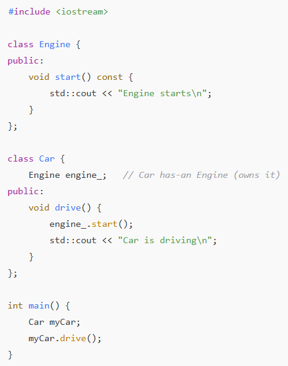

# "is a" and "has a" relationship

* **is a:** -> `Inheritance`
    * **Definition:** A derived class `is a` specialized version of its base class.

##

* **has a:** -> Composition/Aggregation
    * **Definition:** A class `has a` member object of another class, it is composed of --or aggregates-- other objects.
    * **Composition:** owning members (object)
    * **Aggregation:** non-owning pointer or reference

